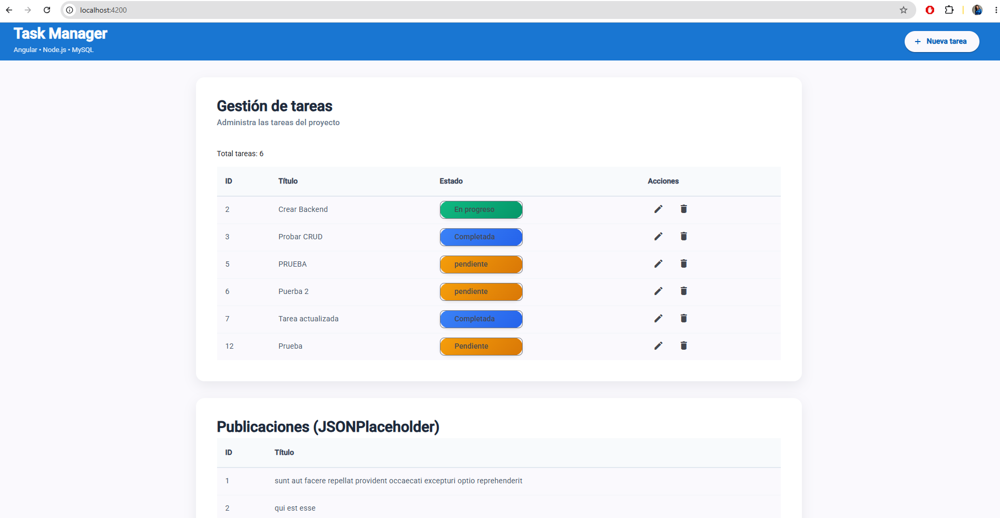
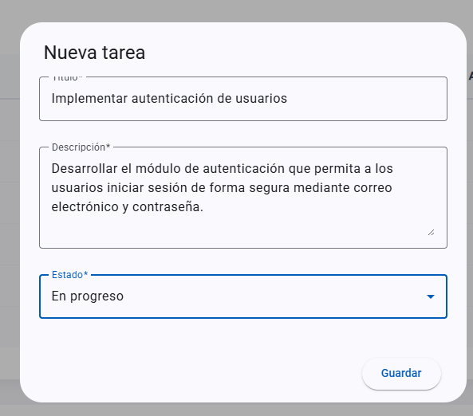
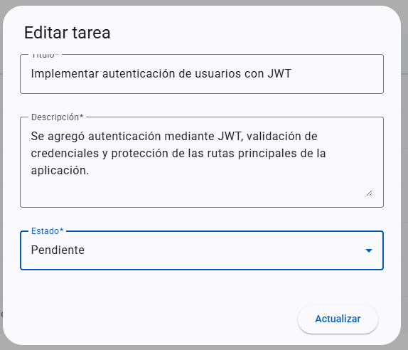
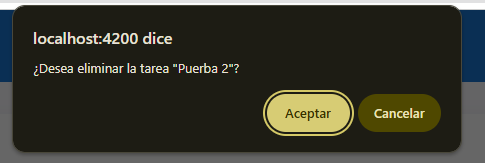
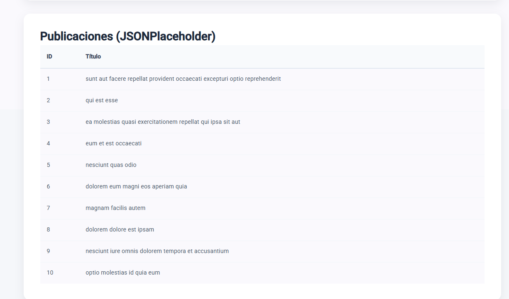

# 📦 Task Manager Frontend

## 🚀 Descripción

Task Manager Frontend es una aplicación desarrollada con **Angular 20** y **Angular Material** que permite gestionar tareas mediante una interfaz moderna e intuitiva.

La aplicación consume una API REST desarrollada en Node.js y Express para realizar operaciones CRUD (Crear, Consultar, Actualizar y Eliminar) sobre tareas almacenadas en MySQL.

Adicionalmente, incluye un componente independiente que consume una API pública (**JSONPlaceholder**) mediante una petición GET, cumpliendo con los requerimientos de la prueba técnica.

---

# ✨ Características

* Interfaz desarrollada con Angular 20.
* Uso de Angular Material.
* Componentes Standalone.
* Formularios Reactivos (Reactive Forms).
* CRUD completo de tareas.
* Diálogo reutilizable para crear y editar tareas.
* Actualización automática de la tabla después de cada operación.
* Consumo de API REST propia.
* Consumo de API pública (JSONPlaceholder).
* Diseño responsive básico.

---

# 🛠 Tecnologías utilizadas

* Angular 20
* Angular Material 20
* TypeScript
* RxJS
* Reactive Forms
* HttpClient
* HTML5
* CSS3
* Git
* GitHub

---

# 🎨 Angular Material

La interfaz utiliza componentes de Angular Material para proporcionar una experiencia de usuario moderna y consistente.

Componentes utilizados:

* Toolbar
* Table
* Card
* Dialog
* Form Field
* Input
* Select
* Button
* Chip
* Icon

---

# 📁 Arquitectura del proyecto

```text
frontend/
│
├── components/
│   ├── toolbar/
│   ├── task-list/
│   ├── task-form/
│   └── public-api/
│
├── models/
│   └── task.ts
│
├── services/
│   ├── task.service.ts
│   └── public-api.service.ts
│
├── app.config.ts
├── app.routes.ts
└── main.ts
```

### Descripción de la estructura

| Carpeta    | Responsabilidad                                |
| ---------- | ---------------------------------------------- |
| components | Componentes visuales de la aplicación.         |
| services   | Comunicación con la API REST y la API pública. |
| models     | Interfaces y modelos de datos.                 |

---

# 🧩 Componentes

## Toolbar

Barra superior de navegación de la aplicación.

---

## Task List

Muestra todas las tareas utilizando una tabla de Angular Material.

Permite:

* Listar tareas
* Editar tareas
* Eliminar tareas

---

## Task Form

Formulario reutilizable para crear y editar tareas mediante un diálogo (MatDialog).

Incluye validaciones utilizando Reactive Forms.

---

## Public API

Componente independiente encargado de consumir información desde:

```text
https://jsonplaceholder.typicode.com/posts
```

Cumpliendo el requisito de consumir una API pública mediante una petición GET.

---

# 🔄 Servicios

## TaskService

Encargado de comunicarse con el Backend mediante HttpClient.

Operaciones implementadas:

* Obtener tareas
* Crear tarea
* Actualizar tarea
* Eliminar tarea

---

## PublicApiService

Consume la API pública JSONPlaceholder para mostrar información en un componente independiente.

---

# 📄 Modelo de datos

La aplicación utiliza la siguiente interfaz:

```typescript
export interface Task {
  id?: number;
  titulo: string;
  descripcion: string;
  estado: string;
  fecha_creacion?: string;
}
```

---

# ⚙ Instalación

Clonar el repositorio:

```bash
git clone https://github.com/Monica3daza0307/task-manager-frontend.git
```

Ingresar al proyecto:

```bash
cd task-manager-frontend
```

Instalar dependencias:

```bash
npm install
```

---

# ▶ Ejecutar el proyecto

Iniciar el servidor de desarrollo:

```bash
ng serve
```

La aplicación estará disponible en:

```text
http://localhost:4200
```

---

# 🚀 Funcionalidades

* Visualizar tareas.
* Crear nuevas tareas.
* Editar tareas existentes.
* Eliminar tareas.
* Mostrar estados mediante Angular Material.
* Consumir una API pública.
* Comunicación con Backend mediante HttpClient.

---

# 📷 Capturas de pantalla

> Agregar aquí las capturas de la aplicación:
>
> * Pantalla principal.

> * Crear tarea.

> * Editar tarea.

> * Eliminar tarea.

> * Componente de API pública.


---

# 🔗 Backend relacionado

Repositorio del Backend:

**https://github.com/Monica3daza0307/task-manager-backend**

---

# 👩‍💻 Autora

**Mónica Daza**

Proyecto desarrollado como parte de una prueba técnica Full Stack utilizando Angular 20, Angular Material, Node.js, Express y MySQL.
